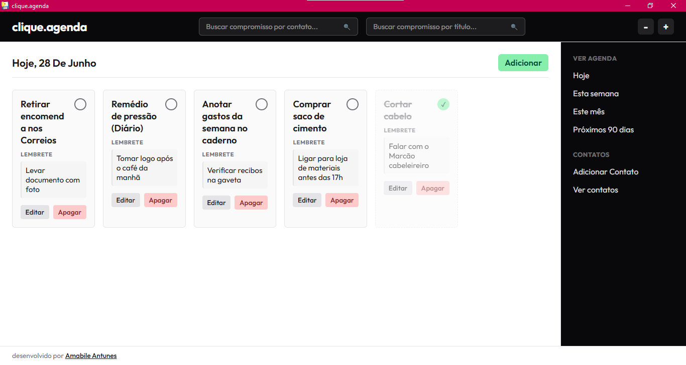
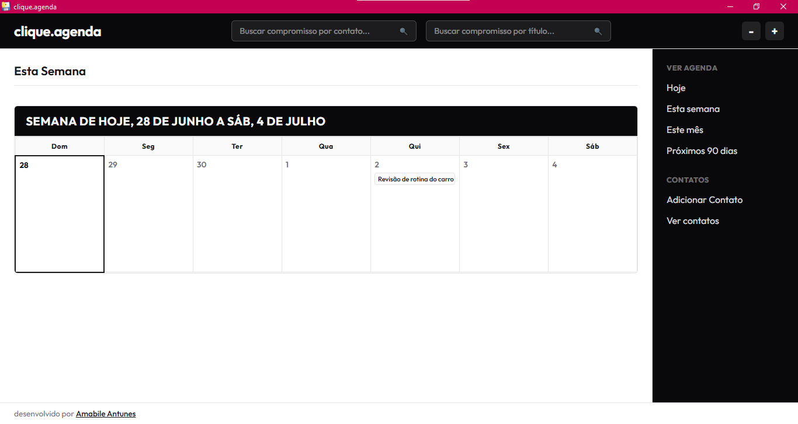
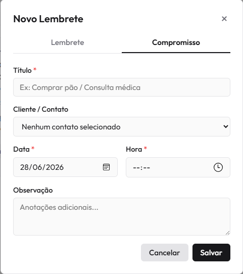

# clique.agenda

Aplicação desktop para gerenciamento de compromissos, lembretes e contatos.

## Sobre o projeto

O **clique.agenda** é uma aplicação desktop desenvolvida em Python para auxiliar pequenos comerciantes, profissionais autônomos e usuários que desejam organizar suas atividades de forma simples e prática.

A aplicação utiliza armazenamento local, dispensando servidores ou conexão com a internet para o funcionamento.

## Funcionalidades

* Cadastro, edição e exclusão de compromissos;
* Cadastro, edição e exclusão de lembretes;
* Gerenciamento de contatos;
* Pesquisa por título ou contato;
* Visualização dos compromissos por:

  * Hoje;
  * Esta semana;
  * Este mês;
  * Próximos 90 dias;
* Marcação de tarefas concluídas;
* Ajuste do tamanho da fonte para melhorar a acessibilidade.

## Tecnologias utilizadas

* Python
* PyWebView
* HTML5
* CSS3
* JavaScript (ES6)
* SQLite

## Estrutura do projeto

```text
CLIQUE.AGENDA/ 
├── .venv/ 
├── controller/ 
│ └── controller.py 
├── imagens/ 
├── models/ 
│ └── agenda_model.py 
├── view/ 
│ └── agenda.js 
│ └── estilo.css 
│ └── index.html 
├── .gitignore 
├── database.py 
├── main.py 
├── README.md 
└── requirements.txt
```

### Principais arquivos

| Arquivo           | Descrição                                                  |
| ----------------- | ---------------------------------------------------------- |
| `main.py`         | Ponto de entrada da aplicação.                             |
| `controller.py`   | Controla a comunicação entre interface e banco de dados.   |
| `database.py`     | Responsável pelas operações de persistência dos dados.     |
| `agenda_model.py` | Modelos utilizados pela aplicação.                         |
| `view/`           | Interface gráfica desenvolvida com HTML, CSS e JavaScript. |

## Interface

### Tela inicial



### Agenda semanal



### Cadastro de compromisso



### Contatos


## Como executar

### Pré-requisitos

* Python 3.14
* Ambiente virtual (opcional, mas recomendado)

### Instalação

Clone o repositório:

```bash
git clone https://github.com/amabile21/clique.agenda.git
```

Instale as dependências:

```bash
pip install -r requirements.txt
```

Execute a aplicação:

```bash
python main.py
```

Ao iniciar, será exibido um menu no terminal:

```text
Escolha uma opção:
(1) Criar executável
(2) Abrir app
>:
```

### Opção 1 — Criar executável

Selecionando a opção **1**, o projeto utiliza o **PyInstaller** para gerar automaticamente um arquivo executável (`.exe`) para Windows.

Após a conclusão do processo, o executável será disponibilizado na pasta:

```text
dist/
└── clique.agenda.exe
```

### Opção 2 — Abrir aplicação

Selecionando a opção **2**, o sistema inicia normalmente utilizando o PyWebView, abrindo a interface desktop da aplicação.

## Banco de dados

A aplicação utiliza o banco de dados SQLite, criado automaticamente na primeira execução caso ainda não exista.

## Licença

Este projeto foi desenvolvido para fins acadêmicos.

## Autora

**Amabile Talia Tchach Antunes**