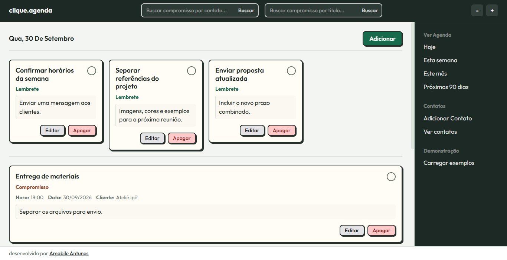
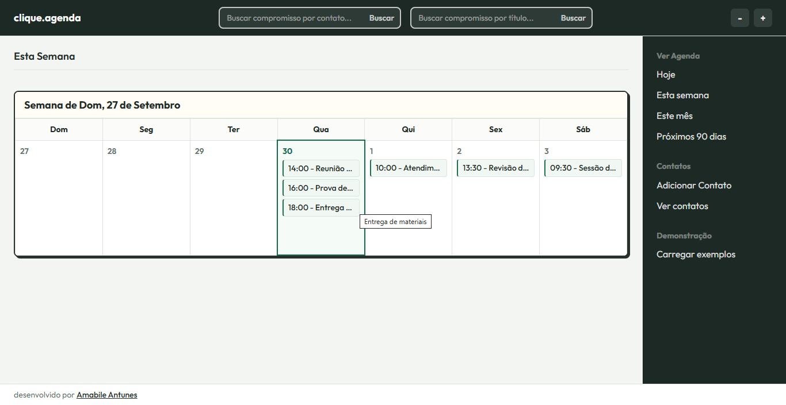
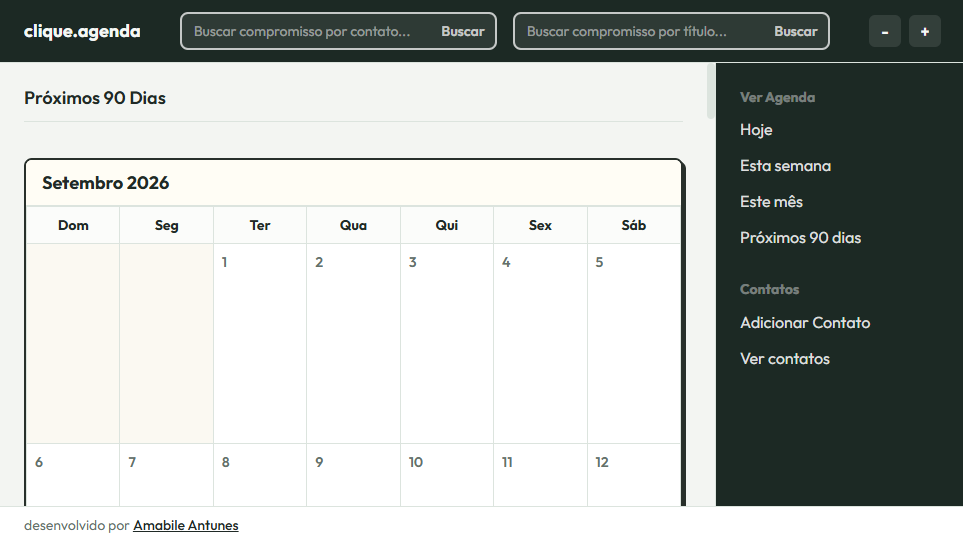
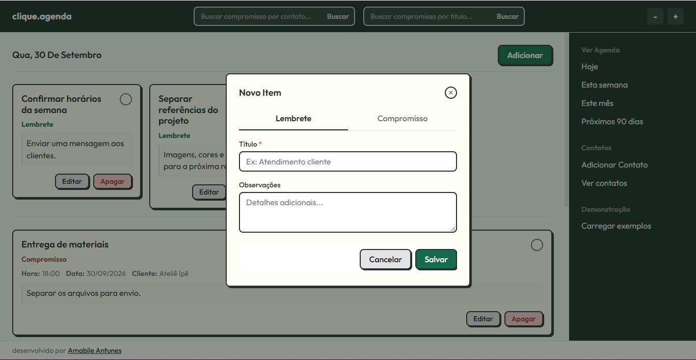
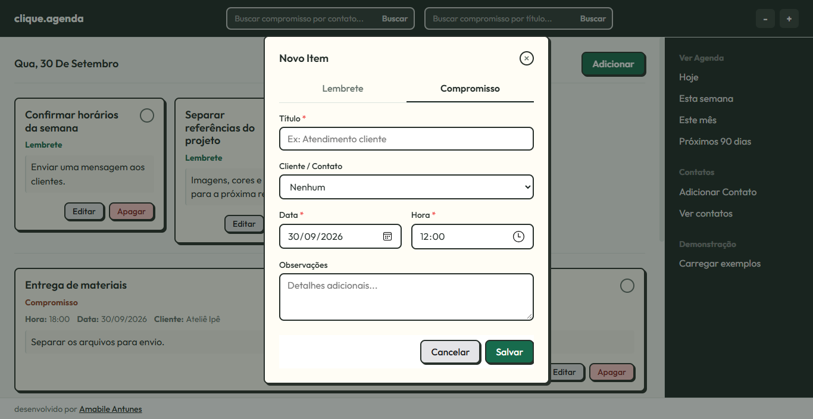
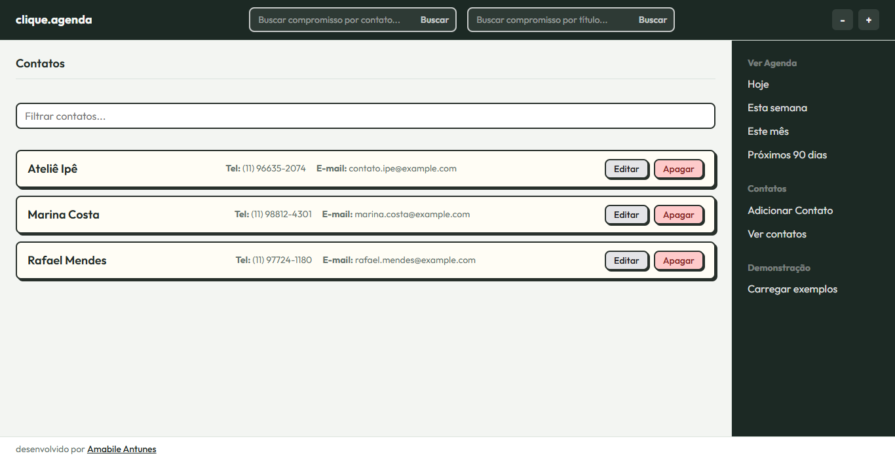
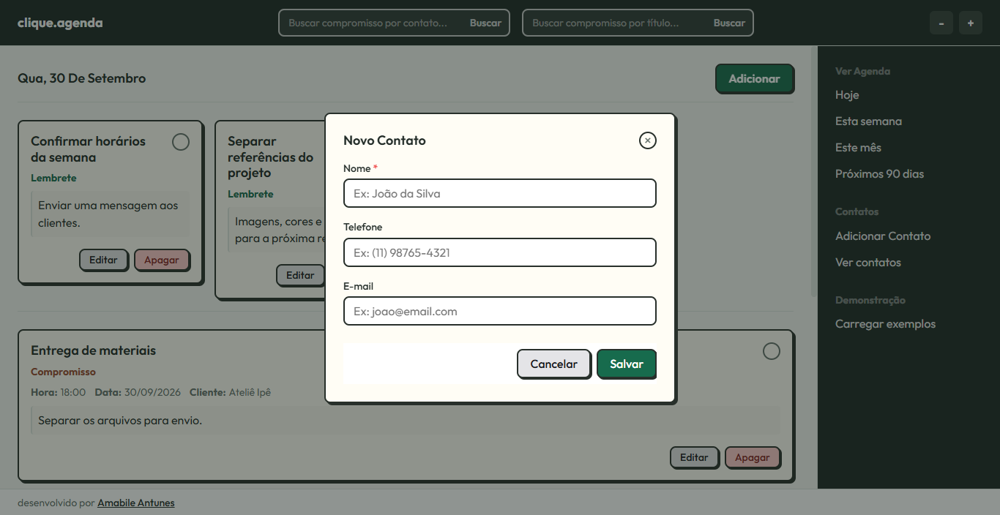

# clique.agenda

Agenda desktop para organizar compromissos, lembretes e contatos em um só lugar. A interface é construída com HTML, CSS e JavaScript e aberta em uma janela nativa por meio do PyWebView. Os dados ficam em um banco SQLite local.

## Funcionalidades

- Criar, editar, excluir e concluir compromissos e lembretes.
- Associar contatos aos compromissos e consultar horário, data e observações.
- Cadastrar, editar, excluir, filtrar e consultar contatos, incluindo telefone e e-mail.
- Pesquisar compromissos por título, observação ou nome do contato, com sugestões de contatos frequentes.
- Consultar a agenda de hoje, da semana, do mês ou dos próximos 90 dias.
- Ajustar o tamanho da fonte em quatro níveis; a preferência fica salva no navegador.
- Validar campos obrigatórios e impedir o cadastro de compromissos em datas ou horários passados.
- Carregar contatos, compromissos e lembretes fictícios para demonstração, sem substituir dados existentes.

## Capturas da interface

### Tela inicial



### Agenda semanal



### Agenda dos próximos 90 dias



### Cadastro de lembrete



### Cadastro de compromisso



### Lista de contatos



### Cadastro de contato



## Tecnologias

- Python 3.14
- PyWebView 6.2.1
- PyInstaller 6.21.0
- HTML5, CSS3 e JavaScript (ES6)
- SQLite

## Estrutura do projeto

```text
clique.agenda/
├── controller/
│   └── controller.py
├── imagens/
├── models/
│   └── agenda_model.py
├── view/
│   ├── agenda.js
│   ├── estilo.css
│   └── index.html
├── database.py
├── main.py
├── README.md
└── requirements.txt
```

`main.py` inicializa a janela e oferece as opções de abrir o app ou criar o executável. `controller/controller.py` conecta a interface às operações da agenda. `models/agenda_model.py` implementa o acesso aos registros, e `database.py` inicializa o SQLite.

## Requisitos

- Windows
- Python 3.14

As dependências Python estão fixadas em `requirements.txt`.

## Instalação e execução

Clone o repositório e instale as dependências:

```powershell
git clone https://github.com/amabile21/clique.agenda.git
cd clique.agenda
python -m pip install -r requirements.txt
```

Inicie o programa:

```powershell
python main.py
```

No menu exibido no terminal, escolha `2` para abrir a aplicação.

## Criar o executável

Com as dependências instaladas, execute `python main.py` e escolha `1`. O PyInstaller gera o executável para Windows em:

```text
dist/clique.agenda.exe
```

## Dados locais

O banco `agenda.db` é criado automaticamente na primeira execução. Durante o desenvolvimento, ele fica na pasta do projeto. Na versão empacotada, o arquivo fica em `%APPDATA%\clique.agenda\agenda.db`.

## Autora

**Amabile Talia Tchach Antunes**